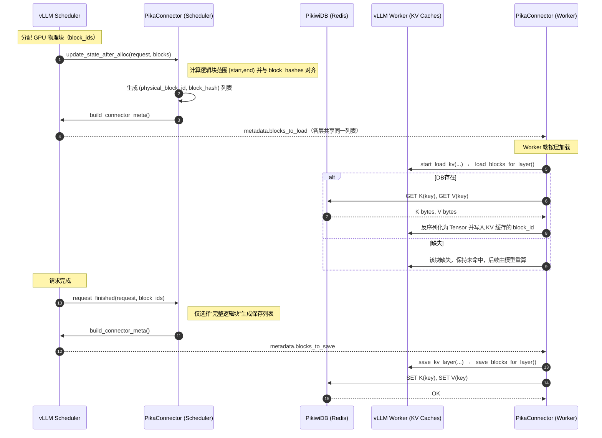
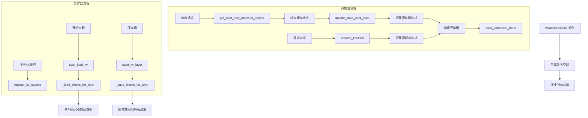

# PikiwiDB KVCache技术文档

**系统组件：**

- vLLM推理引擎：负责LLM推理和KV缓存管理（vLLM v0.10.1）
- PikaConnector：连接vLLM与PikiwiDB的桥梁
- PikiwiDB：外部键值存储，持久化KV缓存块（PikiwiDB v3.5）


## 1 设计实现

### 1.1 数据存储格式

这是一个为 PikiwiDB 实现的专门用于管理 KV cache 的数据结构，专门设计用于与 vLLM 的 PagedAttention 机制高效配合。

#### 1.1.1 KVBlock结构

**键名设计：**

```
kvblock:{namespace}:{layer_idx}:{block_hash}:{k_type}
```

- `namespace`: 基于模型配置生成的唯一标识符，可以用 vLLM 自带的 cache_salt 或自己根据 model_name 等生成哈希值
- `layer_idx`: Transformer层索引 (0, 1, 2, ...)
- `block_hash`: 块内容哈希值，前缀匹配的依据
- `k_type`: 键或值标识（0=Key, 1=Value）

**值设计：**

- 使用PyTorch张量的二进制序列化格式（`numpy().tobytes()`），保持与GPU内存中相同的dtype和形状
- block 形状兼容 4D/5D
  - 4D `kv_layer` ：`[2, num_blocks, num_heads, head_dim]`
  - 5D `kv_layer` ： `[2, num_blocks, block_size, num_heads, head_dim]`
- 说明：为了确保基本实现没问题，暂时只存了Body（tensor 原始二进制数据），没有保存Header（dtype、page_size、head_dim、ttl 等元数据信息）。后续计划加上。

#### 1.1.2 KVBlock命令接口

1. `KVBLOCKSET`
   写入单个块。

   ```
   KVBLOCKSET <ns> <layer_id> <block_hash> <k_type>
   ```

2. `KVBLOCKGET`
   获取单个块。

   ```
   KVBLOCKGET <ns> <layer_id> <block_hash> <k_type>
   ```

3. `KVBLOCKMSET`
   批量写入多个块。

   ```
   KVPAGEMSET N (<ns> <layer_id> <block_hash> <k_type>) * N
   ```

4. `KVBLOCKMGET`
   批量获取多个块。

   ```
   KVPAGEMGET N (<ns> <layer_id> <block_hash> <k_type>) * N
   ```

5. `KVBLOCKEXISTS`
   判断页面是否块。

   ```
   KVBLOCKEXISTS <ns> <layer_id> <block_hash> <k_type>
   ```

**使用示例**

```bash
redis-cli -p 9221 \
  KVPAGESET test_req_001 5 8 42 0 1 128 64 3600 "BLOB_DATA"
KVBLOCKSET "facebook/opt-125m" 0 -3965660778249019479 0

redis-cli -p 9221 \
  KVPAGEGET "facebook/opt-125m" 0 -3965660778249019479 0
```

#### 1.1.3 编译和测试

测试文件位于 `tests/unit` 目录：

- `test_block_builder.py`：验证 KVBlock 的 Key 构建是否符合设计。
- `test_block_commands.py`：验证命令族的正确性，包括：KVBLOCKSET / KVBLOCKGET / KVBLOCKMSET / KVBLOCKMGET / KVBLOCKEXISTS

**编译 PikiwiDB**

```bash
./build.sh
```

**运行单元测试**

```bash
./output/pika -c ./conf/pika.conf
python3 -m unittest test_block_builder.py -v
python3 -m unittest test_block_commands.py -v
```


## 1.2 PikaConnector

本节基于当前仓库中的 `vllm/vllm/distributed/kv_transfer/kv_connector/v1/pika_connector.py` 实现，系统性说明 vLLM 与 PikiwiDB 之间如何进行 KV cache 的保存与加载。

- vLLM 在推理过程中会生成注意力 KV 缓存（KV cache），按固定大小的“块”（block）组织，便于前缀重用与并行执行。
- 本实现通过 PikaConnector 将这些 block 以内存字节的形式存入 PikiwiDB（兼容 Redis 协议），在下一次相同前缀请求时从 DB 直接加载，减少重复计算。

为了一步步确保代码的正确性，暂时先完成最小的功能并测试，目前的实现有：

- [x] **内容寻址**：以 `block_hash` 为键的一部分（跨请求可复用）
- [x] **按块传输**：以 block 为最小单位在 vLLM 和 pikiwidb 间传输数据
- [ ] **前缀命中检测**：只在 layer=0 做连续前缀命中探测。后续扩展。
- [ ] pipeline 传送数据
- [ ] 压缩

#### 1.2.1 参与角色与对象

PikaConnector以两种模式运行：**Scheduler（调度器）**决定哪些块需要加载/保存，**Worker（模型进程/执行器）**实际执行数据加载和保存操作。

- **Scheduler（调度器）**
  1. 询问连接器“还能从外部命中多少 token”（`get_num_new_matched_tokens`）
  2. 分配块后告知连接器“这一步要加载哪些块”（`update_state_after_alloc`）
  3. 每步打包 metadata 给 Worker（`build_connector_meta`）
  4. 请求结束时询问是否需要延迟释放（`request_finished`）
- **Worker（模型进程/执行器）**
  1. 每步收到 metadata 后，**在前向前/中**尝试**加载块**（`start_load_kv` + 私有 `_load_blocks_for_layer`）
  2. 在每层“保存时机”被调用时，**保存块**（`save_kv_layer` + 私有 `_save_blocks_for_layer`）
- **PikiwiDB（Redis）**
  - 作为外部 KV 存储：`GET`/`SET` 按块访问 K/V 二进制
  - 按命名空间 `namespace` 与 `layer_idx`、`block_hash` 区分

#### 1.2.2 关键变量

- 逻辑块（logical block）：由 `block_size` 个连续 token 组成。对于第 i 个逻辑块，其 token 范围为 `[i*block_size, (i+1)*block_size)`。
- 物理块（physical block）：GPU KV 缓存中的实际块位置，使用 `block_id` 标识（索引）。
- `request.block_hashes`：vLLM 原生为每个“完整逻辑块”计算的内容哈希（`hash_value`）。这与物理 `block_id` 没有索引级的一一对应关系，必须通过“计算进度 + 分配顺序”进行映射。

#### 1.2.3 数据流图

- Load（前向之前，按需加载）：调度阶段在分配出物理块后，PikaConnector 根据“尚待计算的逻辑块 → 对应的物理 block_id”建立映射，将这些 `(block_id, block_hash)` 分发至所有层，随后在 worker 端尝试从 DB 加载到对应的物理块。
- Save（请求完成后，按逻辑块保存）：请求完成时，将所有“完整逻辑块”的 `block_hash` 取出，形成 `(placeholder_block_id=logical_idx, block_hash)` 的列表，分发至所有层进行保存操作。保存时以物理块内容写入 DB，但键名使用逻辑块的内容哈希，不依赖具体的物理 ID。



数据块的生命周期：

1. **请求到达**：vLLM接收新的推理请求
2. **缓存查找**：检查PikiwiDB中是否存在匹配的KV块
3. **块加载**：若存在则加载，否则计算新块
4. **推理执行**：使用加载/计算的KV块执行注意力计算
5. **块保存**：将新计算的KV块保存到PikiwiDB
6. **块释放**：请求完成后释放GPU内存中的块

#### 1.2.4 代码流程图



#### 1.2.5 关键实现细节

1) 逻辑块 vs 物理块的映射

- 严禁使用 `enumerate(block_ids)` 的索引 i 与 `request.block_hashes[i]` 直接对齐。
- 正确做法：
  - 根据 `request.num_computed_tokens` 与 `request.num_tokens` 计算逻辑块区间：
    - `start_logical_block = num_computed_tokens // block_size`
    - `end_logical_block = ceil(num_tokens / block_size)`
  - 物理块按照“从第一个未计算 token 起，为后续需要计算的范围顺序分配”。据此将 `block_ids` 顺序与逻辑块顺序对齐，得到 `(physical_block_id, block_hash)`。

2) Save 的占位 ID

- 保存时以逻辑块的 `block_hash` 作为键名的核心，物理 ID 仅用于从 `kv_layer` 里取数据。实现中临时用 `placeholder_block_id = logical_idx`，再映射到对应物理位置取出 tensor 写入。

3) 键命名与命名空间

- 键名：`kvblock:{namespace}:{layer}:{block_hash}:{k_type}`。
- 命名空间优先使用 vLLM `cache_salt`，保证跨进程/多机一致性；无 `cache_salt` 时退化为 `model_config.model`。

4) K/V 数据布局与大小校验

- 支持两类常见布局：
  - 标准 5 维：[2, num_blocks, block_size, num_heads, head_dim]
  - 兼容 4 维：[2, num_blocks, num_heads, head_dim]
- 读取时计算期望字节数：
  - 5D：`block_size * num_heads * head_dim * element_size`
  - 4D：`num_heads * head_dim * element_size`
- 读取后用 `torch.frombuffer(...).reshape(...)` 反序列化，并写回对应 `kv_cache[0 or 1, block_id]`。

5) 只在 layer=0 打印日志

- Load：打印每个 `(block_id, block_hash, key)` 的命中/缺失；
- Save：打印每个保存的 `(physical_block_id, block_hash, key)`；
- 其余层静默，减少噪音。

6) 命中判定（可选且简化）

- `get_num_new_matched_tokens` 示例实现：自 `start_block_idx = num_computed_tokens // block_size` 起，逐个逻辑块检查对应层 0 的 K/V 键是否存在，连续命中即返回命中 token 数（`hit_blocks * block_size`）。

#### 1.2.6 常见问题与排查要点

- 哈希不一致：
  - 未固定 `PYTHONHASHSEED` 时，不同进程的 `NONE_HASH` 可能不同；建议 `os.environ["PYTHONHASHSEED"] = "42"`。
  - 自己生成的 `namespace` 用到了`engine_id` ，不一致导致上下文差异；测试时可固定 `KVTransferConfig(engine_id=...)`。


## 2 使用方式

### 2.1 环境配置

#### 编译安装 PikiwiDB

```bash
./build.sh
```

#### 编译安装 vLLM

需要自己提前检查 CUDA、PyTorch等环境是否适配，否则会出现编译安装报错。

```bash
# 1. 创建并激活虚拟环境（可选）
python3 -m venv vllmenv
source vllmenv/bin/activate

# 2. 编译安装
export VLLM_USE_PRECOMPILED=1
pip install -e .
```


### 2.2 运行

#### 1. 启动 PikiwiDB

确保 PikiwiDB 运行在 `localhost:6379`:

```bash
./output/pika -c ./conf/pika.conf
```

#### 2. 集成到 vLLM

在 demo 中启动 vLLM 时指定连接器：

```python
from vllm import LLM, SamplingParams
from vllm.config import VllmConfig

# 创建配置
config = VllmConfig(
    # ... 其他配置
    kv_transfer_config=kv_transfer_config
)

# 启动 LLM
llm = LLM(
    model="your-model",
    # ... 其他参数
)
```


## 3 Demo

测试用例在 `examples/vllm_integration/minimal_offload.py`，生成的日志为  `examples/vllm_integration/minimal_offload.log`。

#### 基本配置

- **模型**：`facebook/opt-125m`，fp16，`max_seq_len=512`
- **Prompt**：≥256 tokens 公共前缀 + 4 个不同后缀（触发前缀复用）
- **Block 规模（推断）**：单请求加载约 17–18 blocks（对应 ~16 tokens/block）

#### 目的

验证 `PikaConnector`：

1. **Save**：将 vLLM KV blocks 落到 PikiwiDB；
2. **Load**：重建引擎后按 block-hash 命中并回载外部 KV；
3. 观察端到端**稳定性/时延**。

#### 结果

- **Save 成功**：多次 `Saved N/N blocks, 0 errors`；最终 `kvblock:*` ≈ 528 个键。

```bash
(EngineCore_0 pid=825779)   💾 SAVED physical_block_id=5, hash=-149814643624115..., keys=kvblock:facebook/opt-125m:0:-1498146436241157827:0, kvblock:facebook/opt-125m:0:-1498146436241157827:1
...
(EngineCore_0 pid=825779)   💾 SAVED physical_block_id=18, hash=5259193970248814..., keys=kvblock:facebook/opt-125m:0:5259193970248814164:0, kvblock:facebook/opt-125m:0:5259193970248814164:1
(EngineCore_0 pid=825779) 📊 [SAVE] Layer 0: Saved 19/19 blocks, 0 errors
```

- **Load 可命中**：多批日志显示 `Loaded X/X blocks, 0 missing`（已正确回载）。

```
(EngineCore_0 pid=826011) 🔄 [LOAD] Request 0 Layer 0: Loading 18 blocks
(EngineCore_0 pid=826011)   ✅ LOADED block_id=1, hash=-396566077824901..., keys=kvblock:facebook/opt-125m:0:-3965660778249019479:0, kvblock:facebook/opt-125m:0:-3965660778249019479:1
...
(EngineCore_0 pid=826011)   ✅ LOADED block_id=18, hash=-843568115929644..., keys=kvblock:facebook/opt-125m:0:-8435681159296446662:0, kvblock:facebook/opt-125m:0:-8435681159296446662:1
(EngineCore_0 pid=826011) 📊 [LOAD] Layer 0: Loaded 18/18 blocks, 0 missing
```

- **问题**：在后续批次 **Load 卡住并超时**；

#### 可能原因

1. I/O 粒度过细：逐键 GET 往返多、超时设置偏小；需要 pipeline/MGET 分批与更合理超时。
2. 单线程大批 CPU→GPU 拷贝：I/O 与拷贝串行，易形成瓶颈。
3. 批量回传 payload 过大，需要压缩。

#### 后续计划

- **批量化 I/O**：按块数或字节数 **分批 MGET/pipeline**，并提高 client 超时阈值；加 I/O 时延监控。
- **压缩序列**：先对 tensor 进行高效压缩，再回传

> 结论：**外部 KV 的 save 与命中已验证可行**；当前主要瓶颈在 **load 阶段的大批量回读超时。

